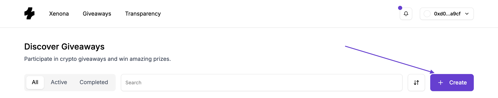
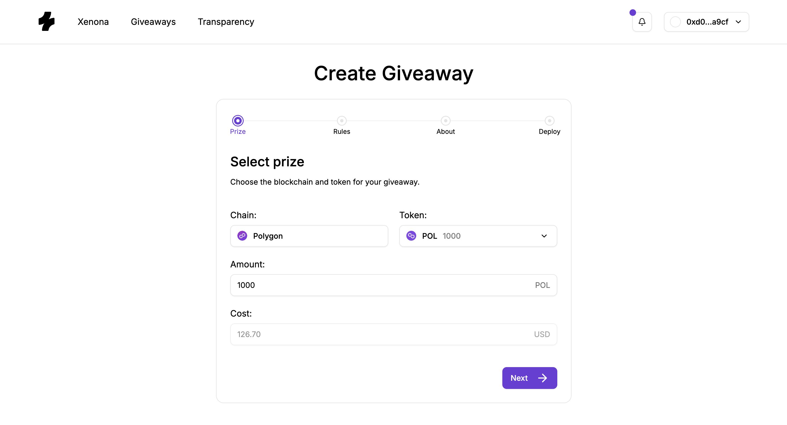
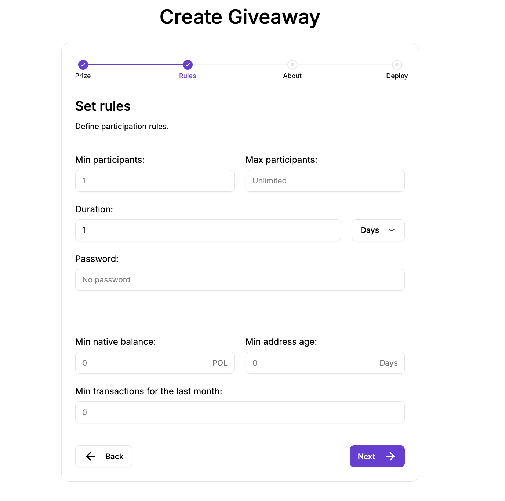
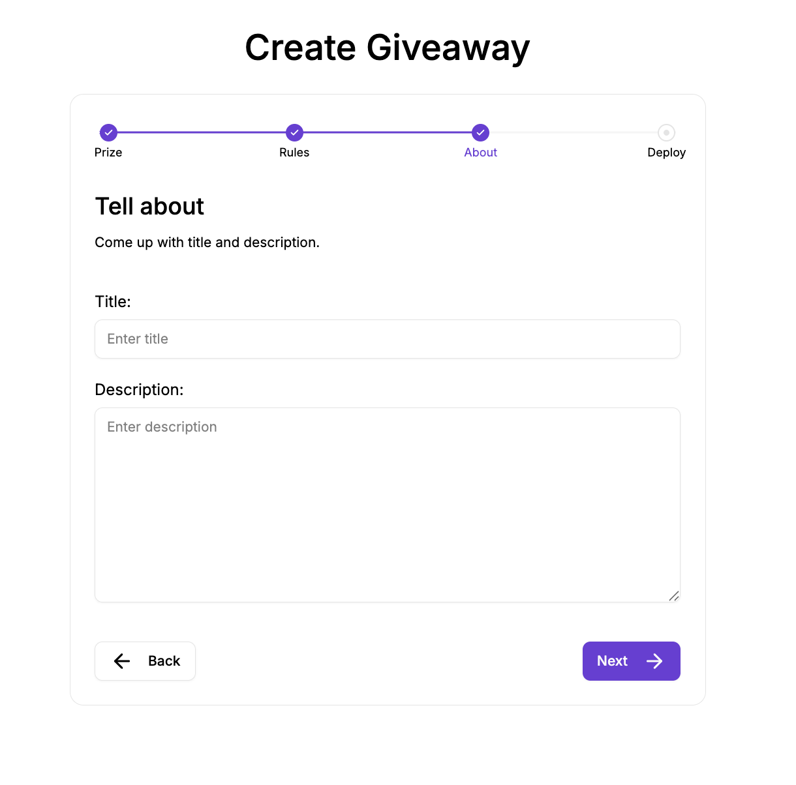

# How to Create a Giveaway

Creating a giveaway on Xenona is designed to be simple, structured, and fully on-chain. The platform walks you through a clear step-by-step flow where you configure your prize, rules, and presentation — and then deploy the giveaway as an autonomous smart contract.

Below is a detailed guide explaining how each step works and why it matters.

---

## 1. Open the Giveaway Creator

Navigate to the **Giveaways** page and click the **Create** button.  
Make sure you are logged in with your wallet.

---

## 2. Complete the Four-Step Creation Flow

You will be redirected to a dedicated creation page containing four configuration steps.

---

### Step 1: Prize Setup

Here you specify the prize that will be locked inside the giveaway smart contract:

- **Chain** — the blockchain on which your giveaway will live.  
- **Token** — the asset you want to give away.  
  You can choose native tokens (like ETH, POL, BNB) or supported ERC-20 tokens.
- **Amount** — the exact amount of prize.  
- **Cost** — a read-only field displaying an approximate USD equivalent of the prize.  
  This helps participants understand the prize’s real-world value.

The information in this step defines the actual on-chain assets the contract will hold. Once the giveaway is deployed, the prize becomes locked and cannot be withdrawn or altered.

---

### Step 2: Entry Rules & Giveaway Parameters

This step defines how the giveaway will function and who is allowed to join.

**Core parameters:**

- **Min / Max Participants** — minimum/maximum amount of participants required for giveaway to complete.  
  The giveaway ends automatically once max participants are reached or the duration expires.
- **Duration** — how long the giveaway stays open.  
  You can enter precise durations like *90 minutes* or *1.5 hours* thanks to decimal support.

**Entry requirements (optional):**

These rules help tailor your giveaway to a specific audience:

- **Password** — only users who know the secret password can enter. 
  You can use it to restrict giveaway only to some closed community members or friends by sharing password with them,
  or if you wanna make a game so user must first guess some secret word to participate.
  In case of the first option make sure your password is strong enough so nobody else can guess it.
- **Minimum Balance** — requires that participants hold at least a certain amount of native tokens on the giveaway’s chain.
- **Minimum Address Age** — restricts entries to wallets older than a chosen number of days.
- **Minimum Transaction Count** — ensures entrants have performed a minimum number of on-chain transactions on the giveaway's chain.

These filters give creators full control over who qualifies, helping eliminate bots, fresh throwaway wallets, or low-effort participants.

---

### Step 3: Title and Description

In this step you can optionally add:

- **Giveaway title**
- **Short description**

This information appears on the giveaway’s public page, helping attract participants and communicate the giveaway’s purpose.

Adding context isn't required but highly recommended for visibility and clarity.

---

### Step 4: Deployment

This final step prepares you for the on-chain deployment of your giveaway contract.

Clicking **Deploy** initiates the required blockchain operations.  
Depending on your setup:

- **Smart Contract Wallet (e.g., Coinbase Smart Wallet, Metamask with enabled smart wallet feature, etc.):**  
  A single signature is enough. The wallet will bundle multiple operations (such as ERC-20 approval + giveaway deployment) into one transaction.
  
- **EOA (regular MetaMask-style wallets):**  
  If your prize is an ERC-20 token, you will need to sign *two* transactions:  
  1. Approve the Factory to transfer your prize tokens  
  2. Deploy the giveaway contract  

If your prize is a native token, only one transaction is required.

**Important:**  
If our backend has been offline or temporarily out-of-sync with the blockchain, giveaway creation may be temporarily disabled. This is rare but possible. If this happens, simply wait a short while until the system catches up and try again.

Once deployment is complete, Xenona will notify you.
If you are still waiting on create page you will be redirected to the giveaway page.

---

## After Deployment

Your giveaway is now live, funded, and running completely on-chain.  
Participants can begin entering immediately based on the rules you defined.

You can track its progress, share its URL, and monitor entries — the smart contract handles the rest fully autonomously.

---

