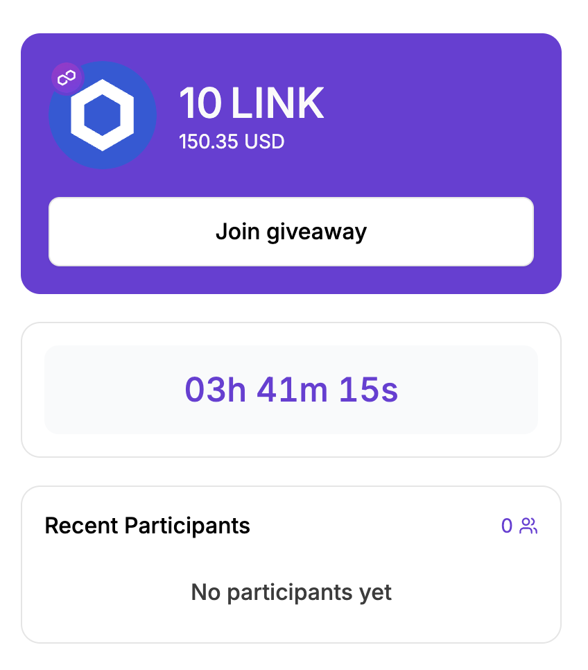
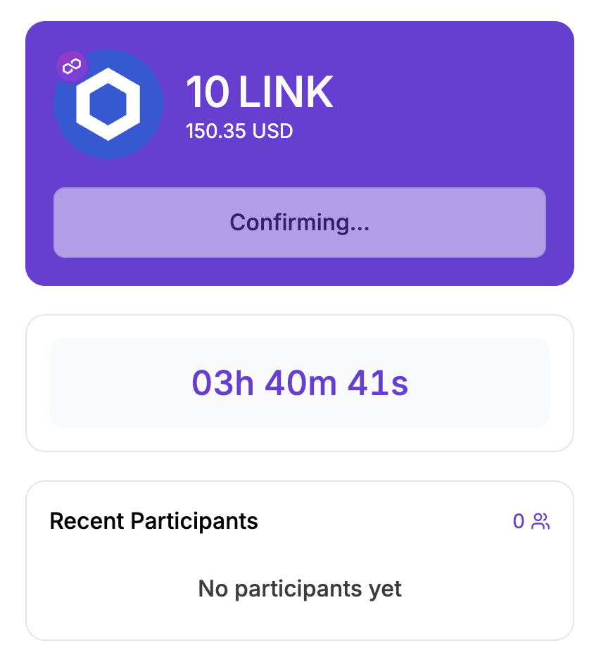
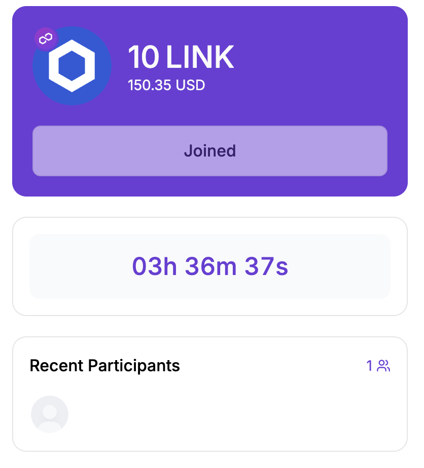

# How to Join a Giveaway

Joining a giveaway on Xenona is simple, secure, and fully on-chain. Every entry you submit is recorded in the giveaway’s smart contract, ensuring transparency and fairness for all participants. Below is a step-by-step guide with explanations for each stage.

---

## 1. Navigate to the Giveaway

Go to the giveaway page for the prize you want to enter. You can browse all active giveaways on the main Giveaways page or use search and filters to find one that matches your interest.

---

## 2. Check Entry Requirements

Some giveaways may have specific entry rules defined by the creator. These could include:

- A secret password  
- Minimum token balance on the giveaway’s blockchain  
- Minimum wallet age  
- Minimum number or volume of past transactions  

Make sure your wallet meets all requirements before attempting to join. If a requirement is not satisfied, the **Join** button will be disabled or you will be unable to complete the entry.

---

## 3. Click the Join Button

If the giveaway is still open and you meet all requirements, the **Join** button will be active. Clicking it begins the process of submitting your entry.

---

## 4. Complete the Entry Transaction

- **Password-protected giveaways:** you will be prompted to enter the password before proceeding.  
- Once the prerequisites are satisfied, Xenona will initiate a blockchain transaction to register your entry in the giveaway smart contract.  

You should approve this transaction in your wallet, it contains a call to the giveaway contract required to enter
After the entry is confirmed on server, the join button will become disabled and you will become a participant

**NOTE:** it may take some time to confirm participation

**Important:**  
If our backend has been offline or temporarily out-of-sync with the blockchain, giveaway entering may be temporarily disabled. This is rare but possible. If this happens, simply wait a short while until the system catches up and try again.

---

With these steps completed, you are successfully participating in the giveaway. The smart contract now tracks your entry automatically, and you can monitor your status or wait for the winner announcement.
